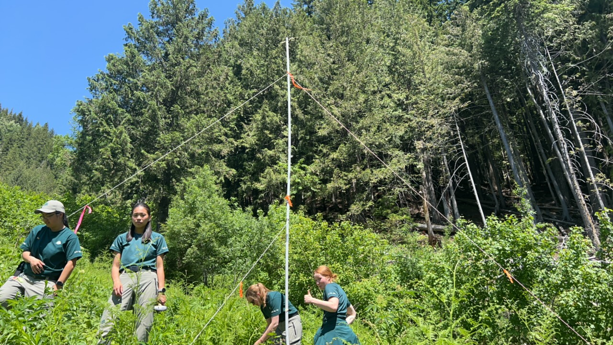
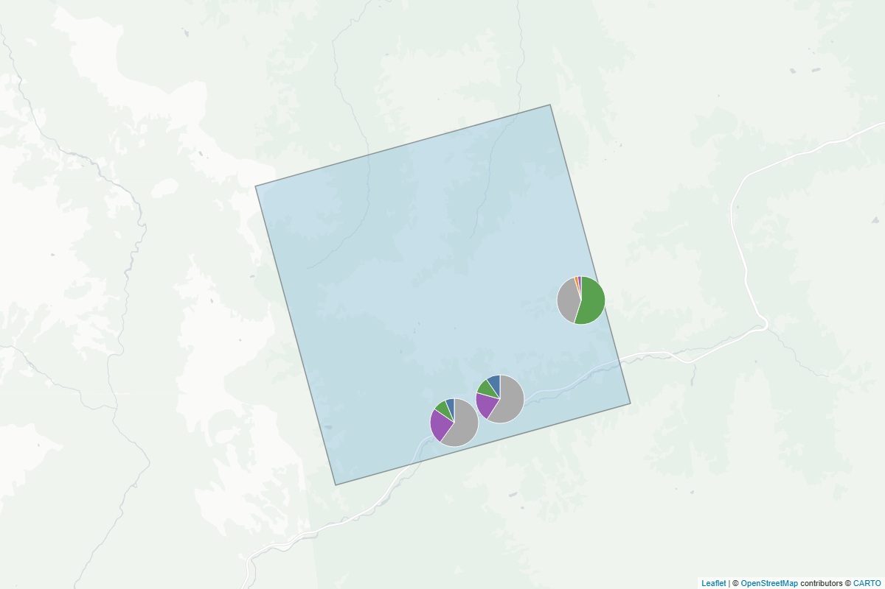
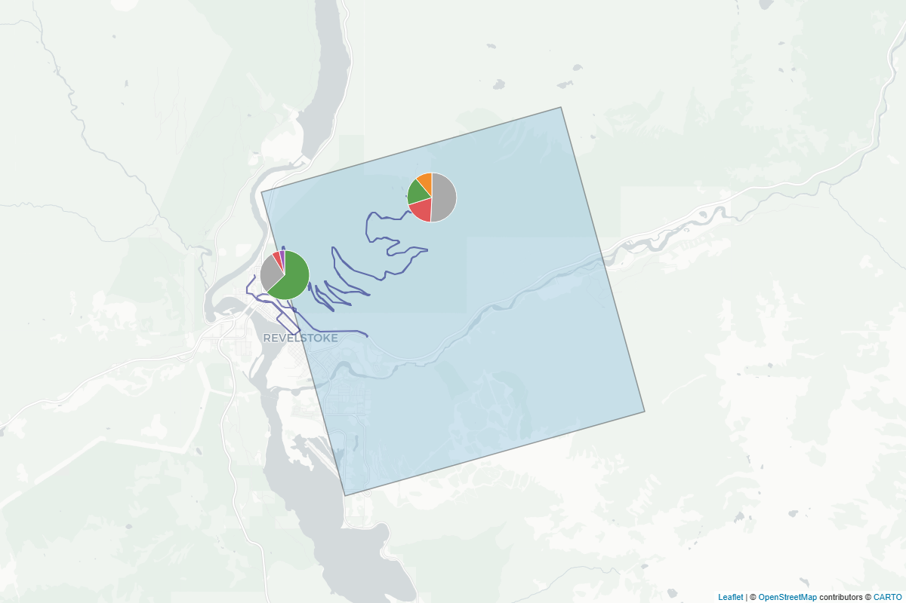

::: {.content-visible when-format="html"}

:::



```{r}
#| label: Load packages and data
#| include: false
#| echo: false
#| eval: true
#| warning: false
#| message: false
 
library(tidyr)
library(dplyr)
library(lubridate)
library(stringr)
library(kableExtra)
library(tidyverse)
library(leaflet)
library(base64enc)
library(mapview)
library(sf)
library(flextable)
library(purrr)

map_data <- read.csv("Data/summary.data.csv")
tdata <- read.csv("Data/transect_summary.csv")
grouped_data <- read.csv("Data/MSummary.csv")
#clean up grouped_data
grouped_data <- rename(grouped_data, '40KMYO' = 'X40KMYO')
GRTS.Cell.ID_header_indices <- which(grouped_data$Site %in% c("241002", "271731"))
totals_index <- which(grouped_data$Site == "Total")
```

```{r}
#| label: Prep summary table
#| include: false
#| echo: false
#| eval: true
#| warning: false
#| message: false

ft <- flextable(grouped_data) |>
  bold(i = GRTS.Cell.ID_header_indices) |>
  bg(i = GRTS.Cell.ID_header_indices, bg = "#BDD7EE") |>
  merge_h(i = GRTS.Cell.ID_header_indices) |>
  bold(i = totals_index) |>
  bg(i = totals_index, bg = "#BDD7EE") |>
  fontsize(size = 8, part = "all") |>
  padding(padding = 2, part = "all") |>
  set_table_properties(layout = "fixed", width = 1) |>
  rotate(rotation = "btlr", part = "header") |>
  height(height = 1.5, part = "header") |>
  width(j = "Site",   width = 0.5) |>
  width(j = c("COTO","EPFU","LACI","LANO","MYCA","MYEV","MYLU",
               "MYSE","MYVO","MYYU","MYOTIS","40KMYO",
               "HIF","LOF","FB","SC"), width = 0.35)
```

```{r}
#| label: Prep data for map
#| include: false
#| echo: false
#| eval: true
#| warning: false
#| message: false

# ── 1. Colour palette ─────────────────────────────────────────────────────────
# SVG pie chart helper 
make_pie_svg <- function(values, colors, size = 70) {
  total <- sum(values)
  if (total == 0) return(NULL)
  fracs  <- values / total
  angles <- cumsum(c(0, fracs)) * 2 * pi
  r <- size / 2 - 2

  slices <- purrr::map2_chr(seq_along(values), colors, function(i, col) {
    a0 <- angles[i]; a1 <- angles[i + 1]
    if (abs(a1 - a0) >= 2 * pi - 1e-6) {
      sprintf('<circle cx="%s" cy="%s" r="%s" fill="%s"/>',
              size/2, size/2, r, col)
    } else {
      x0 <- size/2 + r*sin(a0); y0 <- size/2 - r*cos(a0)
      x1 <- size/2 + r*sin(a1); y1 <- size/2 - r*cos(a1)
      large <- if ((a1 - a0) > pi) 1L else 0L
      sprintf('<path d="M %s %s L %s %s A %s %s 0 %s 1 %s %s Z" fill="%s" stroke="white" stroke-width="1"/>',
              size/2, size/2, x0, y0, r, r, large, x1, y1, col)
    }
  })

  svg <- sprintf('<svg xmlns="http://www.w3.org/2000/svg" width="%s" height="%s">%s</svg>',
                 size, size, paste(slices, collapse = ""))
  paste0("data:image/svg+xml;base64,", base64enc::base64encode(charToRaw(svg)))
}
#this is based ont he spp that appeared the most. Need to update based on needs
sp_colors <- c(
  "EPFU" = "#F28E2B",   # orange
  "LANO" = "#E15759",   # red
  "MYEV" = "#4E79A7",   # blue
  "MYLU" = "#59A14F",   # green
  "MYVO" = "#9B59B6",   # purple
  "Other" = "#AAAAAA"   # grey
)
# ── 2. Build markers ──────────────────────────────────────────────────────────
site_list <- map_data %>%
  group_by(GRTS_Quad, site_name, lat, lon) %>%
  summarise(sp_data = list(tibble(species, n)), total = sum(n), .groups = "drop")

# ── 3. Load other shapefiles───────────────────────────────────────────────────
#load shp for grid cell 
grids <- st_read("Mapping/MRG-NABatGrids.shp") %>%
  st_transform(crs = 4326) #transform to WGS84

transect <- st_read("Mapping/Transect.shp") %>%
  st_transform(crs = 4326) %>% #transform to WGS84
  st_zm(drop = TRUE, what = "ZM") %>% #drop the Z dimension so it renders
  select(geometry)

# ── Transect popup ─────────────────────────────────────────────────────────────
make_transect_table <- function(df, sp_colors) {
  if (nrow(df) == 0) return("<i>No detections</i>")
  
  rows <- purrr::pmap_chr(df, function(Species, n, ...) {
    col <- if (Species %in% names(sp_colors)) sp_colors[Species] else "#AAAAAA"
    sprintf(
      '<tr>
         <td><span style="display:inline-block;width:10px;height:10px;border-radius:50%%;background:%s;margin-right:4px"></span>%s</td>
         <td align="right">%s</td>
       </tr>',
      col, Species, n
    )
  })
  
  sprintf(
    '<table style="width:100%%;font-size:11px;border-collapse:collapse;margin-top:4px">
       <tr><th align="left">Species</th><th align="right">n</th></tr>
       %s
     </table>',
    paste(rows, collapse = "")
  )
}

# Build the three tab content blocks
all_detections  <- tdata %>% group_by(Species) %>% summarise(n = sum(n), .groups = "drop") %>% arrange(desc(n))
night1_emt      <- tdata %>% dplyr::filter(Night == 1, Recorder == "EMT") %>% select(Species, n) %>% arrange(desc(n))
night2_emt      <- tdata %>% dplyr::filter(Night == 2, Recorder == "EMT") %>% select(Species, n) %>% arrange(desc(n))
night2_anabat   <- tdata %>% dplyr::filter(Night == 2, Recorder == "Anabat") %>% select(Species, n) %>% arrange(desc(n))

tab_all     <- make_transect_table(all_detections, sp_colors)
tab_n1      <- make_transect_table(night1_emt, sp_colors)
tab_n2_emt  <- make_transect_table(night2_emt, sp_colors)
tab_n2_anab <- make_transect_table(night2_anabat, sp_colors)

night2_block <- sprintf(
  '<p style="margin:6px 0 2px;font-weight:bold;font-size:11px">EMT</p>%s
   <p style="margin:6px 0 2px;font-weight:bold;font-size:11px">Anabat</p>%s',
  tab_n2_emt, tab_n2_anab
)

# Inline tab switching via onclick IIFE — no <script> tags needed
transect_popup <- sprintf('
<div style="font-family:sans-serif;min-width:220px;max-width:280px">
  <b>Driving Transect</b>
  <hr style="margin:5px 0"/>

  <div style="display:flex;gap:4px;margin-bottom:6px">
    <button id="ttab-all" onclick="(function(){
      document.getElementById(\'tc-all\').style.display=\'block\';
      document.getElementById(\'tc-n1\').style.display=\'none\';
      document.getElementById(\'tc-n2\').style.display=\'none\';
      [\'ttab-all\',\'ttab-n1\',\'ttab-n2\'].forEach(function(id){
        document.getElementById(id).style.fontWeight=\'normal\';
        document.getElementById(id).style.borderBottom=\'2px solid transparent\';
      });
      document.getElementById(\'ttab-all\').style.fontWeight=\'bold\';
      document.getElementById(\'ttab-all\').style.borderBottom=\'2px solid #1d4566\';
    })()"
    style="flex:1;padding:3px 2px;font-size:11px;cursor:pointer;border:none;background:none;border-bottom:2px solid #1d4566;font-weight:bold">
      All
    </button>

    <button id="ttab-n1" onclick="(function(){
      document.getElementById(\'tc-all\').style.display=\'none\';
      document.getElementById(\'tc-n1\').style.display=\'block\';
      document.getElementById(\'tc-n2\').style.display=\'none\';
      [\'ttab-all\',\'ttab-n1\',\'ttab-n2\'].forEach(function(id){
        document.getElementById(id).style.fontWeight=\'normal\';
        document.getElementById(id).style.borderBottom=\'2px solid transparent\';
      });
      document.getElementById(\'ttab-n1\').style.fontWeight=\'bold\';
      document.getElementById(\'ttab-n1\').style.borderBottom=\'2px solid #1d4566\';
    })()"
    style="flex:1;padding:3px 2px;font-size:11px;cursor:pointer;border:none;background:none;border-bottom:2px solid transparent">
      Night 1
    </button>

    <button id="ttab-n2" onclick="(function(){
      document.getElementById(\'tc-all\').style.display=\'none\';
      document.getElementById(\'tc-n1\').style.display=\'none\';
      document.getElementById(\'tc-n2\').style.display=\'block\';
      [\'ttab-all\',\'ttab-n1\',\'ttab-n2\'].forEach(function(id){
        document.getElementById(id).style.fontWeight=\'normal\';
        document.getElementById(id).style.borderBottom=\'2px solid transparent\';
      });
      document.getElementById(\'ttab-n2\').style.fontWeight=\'bold\';
      document.getElementById(\'ttab-n2\').style.borderBottom=\'2px solid #1d4566\';
    })()"
    style="flex:1;padding:3px 2px;font-size:11px;cursor:pointer;border:none;background:none;border-bottom:2px solid transparent">
      Night 2
    </button>
  </div>

  <div id="tc-all">%s</div>
  <div id="tc-n1"  style="display:none">%s</div>
  <div id="tc-n2"  style="display:none">%s</div>
</div>',
  tab_all, tab_n1, night2_block
)

# ── 4. Draw map ───────────────────────────────────────────────────────────────
m <- leaflet() %>%
  addProviderTiles(providers$CartoDB.Positron) %>%
  addPolygons(
    data = grids,
    color = "#444444",
    weight = 1.5,
    fillColor = "#6baed6",
    fillOpacity = 0.3
  ) %>%
  addPolylines(
    data    = transect,
    color   = "#000072",
    weight  = 2,
    popup   = transect_popup,
    label   = "Driving Transect"
  )

all_pie_colors <- c()  # collect colours as we loop

for (i in seq_len(nrow(site_list))) {
  row <- site_list[i, ]
  sp  <- row$sp_data[[1]] %>% arrange(desc(n))

  sp_full <- sp

  top4 <- sp$species[1:min(4, nrow(sp))]
  
  sp_pie <- sp %>%
    mutate(species_pie = if_else(species %in% top4, species, "Other")) %>%
    group_by(species_pie) %>%
    summarise(n = sum(n), .groups = "drop") %>%
    arrange(desc(n)) %>%
    rename(species = species_pie)
  #incorporate spp colours
  unknown_sp <- setdiff(sp_pie$species, names(sp_colors))
   fallback_cols <- setNames(
    colorRampPalette(RColorBrewer::brewer.pal(8, "Dark2"))(max(length(unknown_sp), 1)),
    unknown_sp)
  pie_colors <- c(sp_colors, fallback_cols)[sp_pie$species]
  pie_colors <- setNames(pie_colors, sp_pie$species)  
  # Accumulate colours across sites
  all_pie_colors <- c(all_pie_colors, pie_colors)
  uri <- make_pie_svg(sp_pie$n, pie_colors[sp_pie$species])
  popup_rows <- sp_full %>%
    mutate(pct = round(n / sum(n) * 100, 1)) %>%
    purrr::pmap_chr(function(species, n, pct) sprintf(
      '<tr><td><span style="display:inline-block;width:10px;height:10px;border-radius:50%%;background:%s;margin-right:4px"></span>%s</td><td align="right">%s</td><td align="right">%s%%</td></tr>',
      ifelse(species %in% names(pie_colors), pie_colors[species], "#AAAAAA"),
      species, n, pct))
  popup <- sprintf(
    '<div style="font-family:sans-serif;min-width:180px"><b>%s</b><br/><small>%s</small><hr style="margin:5px 0"/><b>%s</b> detections<table style="width:100%%;margin-top:4px"><tr><th align="left">Species</th><th align="right">n</th><th align="right">%%</th></tr>%s</table></div>',
    row$site_name, row$GRTS_Quad, row$total,
    paste(popup_rows, collapse = ""))
  m <- m %>% addMarkers(
    lng  = row$lon, lat = row$lat,
    icon = makeIcon(iconUrl = uri, iconWidth = 70, iconHeight = 70,
                    iconAnchorX = 35, iconAnchorY = 35),
    popup = popup,
    label = row$site_name
  )
}

# ── 7. Legend HTML (built after loop so we know which species appear) ─────────
# Deduplicate: keep first occurrence of each species name
legend_colors <- all_pie_colors[!duplicated(names(all_pie_colors))]
legend_colors <- legend_colors[order(names(legend_colors))]  # alphabetical
if ("Other" %in% names(legend_colors)) {
  # Move "Other" to the end
  legend_colors <- c(legend_colors[names(legend_colors) != "Other"],
                     legend_colors["Other"])
}

legend_html <- htmltools::tags$div(
  style = "background:white;padding:10px 14px;border-radius:6px;box-shadow:0 1px 5px rgba(0,0,0,.3);font-family:sans-serif;font-size:12px;max-height:300px;overflow-y:auto;",
  htmltools::tags$b("Species"),
  htmltools::tags$hr(style = "margin:4px 0"),
  htmltools::HTML(paste(purrr::map_chr(names(legend_colors), ~sprintf(
    '<div style="display:flex;align-items:center;margin-bottom:3px"><span style="display:inline-block;width:12px;height:12px;border-radius:50%%;background:%s;margin-right:6px"></span>%s</div>',
    legend_colors[.x], .x)), collapse = ""))
)

m <- m %>% addControl(legend_html, position = "bottomright")

```

```{r}
#| include: false
#| label: set up fig reference so it changes based on html or pdf
fig_ref <- if (knitr::pandoc_to("html")) {
  "[@fig-monitoring-locations]"
} else {
  "[@fig-glacier;@fig-revelstoke]"
}
```

# Executive Summary

# Land Acknowledgement

Biodiversity Pathways respectfully acknowledges that our work takes place on Treaty 8 and Douglas Treaties Territories as well as the traditional and unceded territories of First Nations and Métis Peoples across all regions of British Columbia, whose histories, languages, and cultures are deeply connected to the biodiversity we monitor. We acknowledge the traditional teachings of the lands that we work on, and that reciprocal, meaningful, and respectful relationships with Indigenous peoples make our work possible. We are deeply grateful for their stewardship of these lands, and we are committed to supporting Indigenous-led monitoring programs, while learning Indigenous ways of knowing, being, and doing.

# Background

## Overview of NABat and the NNW Bat Hub

The North American Bat Monitoring Program (NABat) is a large-scale coordinated effort to monitor bat species across North America using standardized protocols and a unified sample design [@loeb2015Plan]. NABat was established to address the gaps in knowledge and lack of long-term studies of bat species across Mexico, USA, and Canada. The program is administered by the US Geological Survey (USGS), coordinated by the Canadian Wildlife Health Cooperative (CWHC) in Canada, and implemented by the North by Northwest Bat (NNW) Hub in British Columbia, Alberta, and S.E. Alaska.

## NABat Monitoring at Mount Revelstoke and Glacier National Parks

Mount Revelstoke and Glacier National Parks have monitored two NABat grid cells since 2017 and have collected 9 years of data. Both grid cells are in southeastern BC. Mount Revelstoke contains 2 stationary bat detectors and 1 transect route while Glacier contains 3 stationary detectors, all detectors were deployed in primarily forest habitat.

In 2025, the transect route was monitored using two acoustic recording units, the Anabat and the EchoMeter Touch Pro, to evaluate differences in species detection between the two detectors. This comparison will inform the park's transition to the EchoMeter Touch Pro for future data collection.

# Methodology

Full-spectrum recordings from the sampling periods were processed using two automatic classifiers: Kaleidoscope's Bats of North America 5.4.0 classifier and Sonobat 3.0's Southeastern British Columbia classifier. Based on documented species ranges, manual identification efforts focused on 10 species: Townsend's big-eared bat (*Corynorhinus townsendii*), Big Brown Bats (*Eptesicus fuscus*), Silver-haired Bats (*Lasionycteris noctivagans*), Hoary Bat (*Lasiurus cinereus*), California Myotis (*Myotis californicus*), Long-eared myotis (*Myotis evotis*), Little Brown Myotis (*Myotis lucifugus*), Northen Myotis (*Myotis spententrionalis*), Long-legged Myotis (*Myotis volans*), and Yuma Myotis (*Myotis yumanensis*).

The analysis workflow followed processing standards established by the North American Bat Monitoring Program (NABat) [@reichert2018Guide]. Only recordings that were identified as a bat by Kaleidoscope were eligeble to be manually verified. Species identifications were validated using reference call parameters described by @szewczak2018Acoustic, @slough2022New, and @solick2022Bat, in accordance with NABat manual vetting protocols [@reichert2018Guide]. All species codes used in the analysis are summarized in [Appendix A]

# Results and Discussion

## Species detection

All previously detected species were identified again across sites. Feeding buzzes were recorded in the NW quadrant of the Mount Revelstoke grid cell and the SW quadrant of the Glacier grid cell [@tbl-msummary], and one social call was recorded in the NW quadrant of the Mount Revelstoke cell.

Results from the full dataset, including automated ID, indicate that the most commonly recorded species across both grid cells is the Little Brown Bat (*Myotis lucifugus*; MYLU) (`r fig_ref` ).

```{r}
#| echo: false
#| eval: true
#| warning: false
#| message: false
#| include: true
#| tbl-cap: Manual verification summary results across grid cells and sites. 
#| label: tbl-msummary
ft
```

```{r}
#| echo: false
#| eval: true
#| warning: false
#| message: false
#| include: true
#| fig-cap: Acoustic monitoring sites within the Mount Revelstoke and Glacier National Park NABat grid cells, 2025. Pie charts indicate the proportional composition of bat species detections by AutoID at each site. Click a marker to view species detection totals; click the transect line to view detections by night and recorder.
#| label: fig-monitoring-locations

if (knitr::is_html_output()) {
  m
} else {
  pad <- 0.01
  
  bbox_list <- list(
    list(
      lng1 = -118.2136 + pad, lat1 = 50.95249 + pad,
      lng2 = -118.0392 - pad, lat2 = 51.06404 - pad,
      title = "Mt. Revelstoke Sites"
    ),
    list(
      lng1 = -117.7420 + pad, lat1 = 51.22348 + pad,
      lng2 = -117.5671 - pad, lat2 = 51.33451 - pad,
      title = "Glacier Sites"
    )
  )
  
  dir.create(file.path(getwd(), "Figures"), showWarnings = FALSE)
  
  for (bbox in bbox_list) {
    map_file <- file.path(getwd(), "Figures", paste0(gsub("[^a-zA-Z0-9]", "_", bbox$title), ".png"))
    
    m_zoomed <- m %>%
      fitBounds(
        lng1 = bbox$lng1, lat1 = bbox$lat1,
        lng2 = bbox$lng2, lat2 = bbox$lat2
      ) %>%
      addControl(legend_html, position = "bottomright")
    
    tryCatch({
      mapview::mapshot2(
        m_zoomed,
        file = map_file,
        delay = 5,
        vwidth = 1200,
        vheight = 800
      )
    }, error = function(e) {
      message("mapshot2 failed for ", bbox$title, ": ", e$message)
    })
  }
  
  invisible(NULL)
}
```

::: {.content-visible when-format="pdf"}
{#fig-glacier fig-pos="H"}

{#fig-revelstoke fig-pos="H"}
:::

## Paired deployments for the transect

The EchoMeter Touch Pro, which records in full spectrum, produced bat calls that were more readily identifiable to the species level compared to the Anabat zero-crossing recorder. However, this difference was not substantial between units, suggesting that transitioning to the EchoMeter Touch Pro is unlikely to require a correction factor. The province-wide analysis, which includes up to 20 sites and transects with paired deployments, will examine the use of correction factors more closely. Should that larger dataset suggest otherwise, a correction factor can be revisited when trend estimates are calculated for this grid cell.

## Data Availability

All tag data has been uploaded to NABat under project name [MRG-NABat Monitoring (ID: 16822)](https://sciencebase.usgs.gov/nabat/#/projects/16822). Recordings and tag data can also be found in Wildtrax under the project name [Bat community - Long Terms Monitoring - NaBat - 2024/25](https://portal.wildtrax.ca/aru/4353)

# Appendix A

```{r}
#| label: speciescodes
#| include: true
#| echo: false
#| warning: false
#| message: false
#|
def <- read.csv("Data/species_codes_reference.csv")

# Split into sections by Type
type_order <- c("Species", "Couplet/Grouping", "Frequency Class")
def_ordered <- def |>
  dplyr::mutate(Type = factor(Type, levels = type_order)) |>
  dplyr::arrange(Type)

# Columns to display - drop Type since it becomes group headers
def_display <- def_ordered |>
  dplyr::select(`Code` = Four.Letter.Code,
                `Common Name` = Common.Name,
                `Scientific Name` = Scientific.Name,
                `Definition` = Definition)

# Find where each Type group starts for header row insertion
type_indices <- which(!duplicated(def_ordered$Type))

# Build grouped data with type header rows
grouped_def <- purrr::map_dfr(type_order, function(t) {
  rows <- def_ordered |> dplyr::filter(Type == t)
  if (nrow(rows) == 0) return(NULL)
  
  header <- data.frame(
    Code       = t,
    Common.Name     = "",
    Scientific.Name = "",
    Definition      = ""
  )
  names(header) <- c("Code", "Common Name", "Scientific Name", "Definition")
  
  data_rows <- rows |>
    dplyr::select(`Code` = Four.Letter.Code,
                  `Common Name` = Common.Name,
                  `Scientific Name` = Scientific.Name,
                  `Definition` = Definition)
  
  dplyr::bind_rows(header, data_rows)
})

# Find header row indices
header_indices <- which(grouped_def$Code %in% type_order)

flextable(grouped_def) |>
  bold(i = header_indices) |>
  bg(i = header_indices, bg = "#BDD7EE") |>
  merge_h(i = header_indices) |>
  italic(j = "Scientific Name") |>
  fontsize(size = 9, part = "all") |>
  padding(padding = 3, part = "all") |>
  set_table_properties(layout = "fixed", width = 1) |>
  width(j = "Code",           width = 0.7) |>
  width(j = "Common Name",    width = 1.3) |>
  width(j = "Scientific Name",width = 1.5) |>
  width(j = "Definition",     width = 3.0)
```



::: {.content-visible when-format="pdf"}
# Literature Cited
:::
